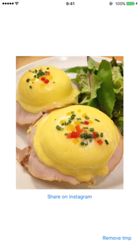

# EggsBenedict
[](https://travis-ci.org/JPMartha/EggsBenedict) [](https://github.com/Carthage/Carthage) → [日本語](./Documentation/README_ja.md)

__EggsBenedict__ is a library for sharing picture with Instagram app written in Swift.



This library is following Instagram's sharing flow.

> __Instagram's documentation__

> - [Document Interaction](https://www.instagram.com/developer/mobile-sharing/iphone-hooks/#document-interaction)

If the custom URL `instagram://` can be opened direct users on the iOS device, the flow is as follows.

1. Save temporary file named  `"jpmarthaeggsbenedict"` (JPEG format) in "tmp/" directory using the filename extension `".ig"` or `".igo"`.
2. Display the menu for copying to Instagram app.
3. If users tap the "Copy to Instagram" icon, open Instagram app with its filter screen.

  > The image is preloaded and sized appropriately for Instagram. For best results, Instagram prefers opening a JPEG that is 640px by 640px square. If the image is larger, it will be resized dynamically.

#### _\- By the way, why was it named "EggsBenedict"?_

The reason is because I like Eggs Benedict 😋

## Availability

- Swift 2.1
- Xcode 7.2
- iOS 8.0 and later

## Adding EggsBenedict.framework to your project

#### [Carthage](https://github.com/Carthage/Carthage) (preferred)

1. Create a [Cartfile](https://github.com/Carthage/Carthage/blob/master/Documentation/Artifacts.md#cartfile), and add `github "JPMartha/EggsBenedict" ~> 0.9.6`.
2. Run `$ carthage update --platform iOS` in your project directory.
3. On your application targets’ “Build Phases” settings tab, in the “Link Binary With Libraries” section, click the “+” icon and add `EggsBenedict.framework` from the Carthage/Build folder on disk.
4. On your application targets’ “Build Phases” settings tab, click the “+” icon and choose “New Run Script Phase”. Create a Run Script with the following contents: 
  ```
  /usr/local/bin/carthage copy-frameworks
  ```
  and add the "Input Files" to EggsBenedict.framework:
  ```
  $(SRCROOT)/Carthage/Build/iOS/EggsBenedict.framework
  ```
  
  This script works around an [App Store submission bug](http://www.openradar.me/radar?id=6409498411401216) triggered by universal binaries and ensures that necessary bitcode-related files are copied when archiving.
  
#### [CocoaPods](https://cocoapods.org)

1. Create a [Podfile](https://guides.cocoapods.org/using/the-podfile.html), and add `pod 'EggsBenedict', '~> 0.9.6'`.
2. Run `$ pod install` in your project directory.

## Getting started

1. On your application Info.plist, add `LSApplicationQueriesSchemes` key.

  Key                                           |Type    |Value
  ------------------------------------|--------|-----------
  LSApplicationQueriesSchemes | Array | instagram

2. Create an instance of `SharingFlow` class with the `SharingFlowType` enumeration.

  ```swift
  let sharingFlow = SharingFlow(type: .IGOExclusivegram)
  ```
  
  #### SharingFlowType enumeration

  According to the [Instagram's documentation](https://www.instagram.com/developer/mobile-sharing/iphone-hooks/#document-interaction), you can use two ways in Instagram's sharing flow. `SharingFlowType` is the enumeration following them.

  - `IGPhoto`
  
    Show Instagram plus any other public/jpeg-conforming apps in the application list.

  - `IGOExclusivegram` (preferred)
  
    Show only Instagram in the application list. (Actually, some apps are shown.)

3. Call `presentOpenInMenuWithImage` method with two required parameters and two optional parameters.

  ```swift
  sharingFlow.presentOpenInMenuWithImage(YourImage, view: YourView, documentInteractionControllerDelegate: nil) { (result) -> Void in
      // Handling Errors
  }
  ```
  
  #### Parameters
  
  - image: `UIImage!`
  
    The image for sending to Instagram app.
    
  - view: `UIView!`
  
    The view from which to display the menu.
    
  - documentInteractionControllerDelegate: `UIDocumentInteractionControllerDelegate?`
  
    The delegate you want to receive document interaction notifications. You may specify `nil` for this parameter.
    
  - completion: `((result: Result<Any>) -> Void)?`
  
    The block to execute after the presenting menu. You may specify `nil` for this parameter.
    
    - Handling Errors Example
    
      ```swift
      switch result {
      case .Success(let imagePath):
          print("Success: \(imagePath)")
      case .Failure(let error):
          print("Error: \(error)")
      }
      ```

## Remove temporary image

To remove temporary image in "tmp/" directory, call `removeTemporaryImage` method of the created instance.

  ```swift
  sharingFlow.removeTemporaryImage { (result) -> Void in
      // Handling Errors
  }
  ```
  
#### Parameters
  
  - completion: `((result: Result<Any>) -> Void)?`
  
    The block to execute after the removing temporary image finishes. You may specify nil for this parameter.
    
    - Handling Errors Example
    
      ```swift
      switch result {
      case .Success(let imagePath):
          print("Success: \(imagePath)")
      case .Failure(let error):
          print("Error: \(error)")
      }
      ```

## License

__EggsBenedict__ is released under the [MIT License](LICENSE).
